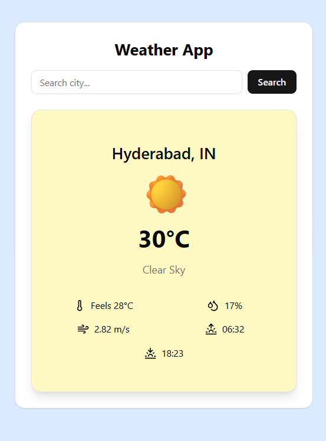

 # 🌤 Weather App

A modern and responsive weather application built with **React, Vite, and Tailwind CSS** that fetches real-time weather data from the **OpenWeather API**.

The app allows users to search for any city and view detailed weather information including temperature, humidity, wind speed, and sunrise/sunset times with smooth animations.

---

## 🚀 Features

* 🔍 Search weather by city
* 🌡 Real-time temperature display
* 💧 Humidity information
* 🌬 Wind speed details
* 🌅 Sunrise & 🌇 sunset time
* 🎨 Dynamic UI based on weather conditions
* ✨ Smooth animations using Framer Motion
* 📱 Fully responsive design
* ⚡ Fast data fetching using React Query

---

## 🛠 Tech Stack

* **React**
* **Vite**
* **Tailwind CSS**
* **TanStack React Query**
* **Framer Motion**
* **Lucide Icons**
* **OpenWeather API**
* **shadcn/ui components**

---

## 📂 Project Structure

```
src
│
├── components
│   ├── SearchBar.jsx
│   ├── WeatherCard.jsx
│   ├── Loader.jsx
│
├── hooks
│   └── useWeather.js
│
├── services
│   └── weatherApi.js
│
├── App.jsx
├── main.jsx
└── index.css
```

---

## ⚙ Installation

Clone the repository:

```
git clone https://github.com/yourusername/weather-app.git
```

Navigate to the project folder:

```
cd weather-app
```

Install dependencies:

```
npm install
```

Start the development server:

```
npm run dev
```

---

## 🔑 Environment Variables

Create a `.env` file in the root directory and add your OpenWeather API key.

```
VITE_WEATHER_KEY=your_api_key_here
```

Get your API key from:
https://openweathermap.org/api

---

## 🌍 API Used

OpenWeather Current Weather API

Example endpoint:

```
https://api.openweathermap.org/data/2.5/weather?q=London&appid=API_KEY&units=metric
```

---

## 📸 Screenshots

### Weather Result

Example:

* Weather search interface
* Weather result card
* Mobile responsive view

---

## 📈 Future Improvements

* 📍 Detect user location
* 📅 5-day weather forecast
* 🌈 Animated weather backgrounds
* 🌙 Dark mode support
* 🎤 Voice search for cities

---

## 👨‍💻 Author

Built by **Ashif Shaik**

---
